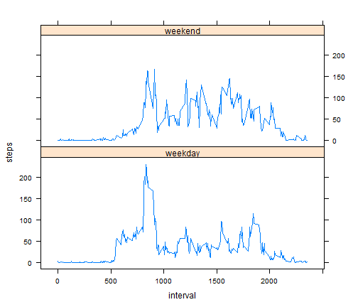

Reproducible Research - Course Project 1
========================================================

## Loading and preprocessing the data

Load the provided data into R:


```r
data <- read.csv(file = "activity.csv", header = TRUE, skip = 0, colClasses = c("numeric", 
    "Date", "numeric"))
```


## What is mean total number of steps taken per day?

Calculate the total number of steps taken each day:


```r
stepsperday <- aggregate(steps ~ date, FUN = sum, data = data)
```


Make a histogram of the total number of steps per day:


```r
hist(stepsperday$steps, breaks = 50)
```

 


Calculate the mean of the total steps per day:


```r
mean(stepsperday$steps)
```

```
## [1] 10766
```


Calculate the median of the total steps per day:


```r
median(stepsperday$steps)
```

```
## [1] 10765
```


## What is the average daily activity pattern?

Calculate the mean number of steps taken in each time interval and plot it:


```r
meanperinterval <- aggregate(steps ~ interval, FUN = mean, data = data)
plot(meanperinterval$interval, meanperinterval$steps, type = "l")
```

 


The 5-min interval with the maximum number of steps on average is interval 

```r
maxint <- meanperinterval$interval[which(meanperinterval$steps == max(meanperinterval$steps))]
print(maxint)
```

```
## [1] 835
```


## Imputing missing values

The total number of missing values is


```r
sum(is.na(data$steps))
```

```
## [1] 2304
```


create a copy of the original dataset, datafilled, and run through the step variable and fill all the missing values with the average for this 5-min interval:

```r
datafilled <- data
for (i in 1:length(datafilled$steps)) {
    if (is.na(datafilled$steps[i])) {
        datafilled$steps[i] <- meanperinterval$steps[which(meanperinterval$interval == 
            datafilled$interval[i])]
    }
}
rm(i)
```


Repeat the histogram, mean and median as in the beginning for the new dataset:


```r
stepsperdayfilled <- aggregate(steps ~ date, FUN = sum, data = datafilled)
hist(stepsperdayfilled$steps, breaks = 50)
```

 

```r
mean(stepsperdayfilled$steps)
```

```
## [1] 10766
```

```r
median(stepsperdayfilled$steps)
```

```
## [1] 10766
```


The mean of the total number of steps per day hasn't been influenced, since only averaged values were inserted. 
However, the median changes, since the distribution of steps per day is slightly altered.

## Are there differences in activity patterns between weekdays and weekends?

Make a loop through all the data points, determine if the date is a day in the week or during the weekend, write it in an additional column and convert it to a factor:

```r
for (j in 1:length(datafilled$date)) {
    if (weekdays(datafilled$date[j]) == ("Samstag") | weekdays(datafilled$date[j]) == 
        ("Sonntag")) {
        datafilled$daytype[j] <- "weekend"
    } else {
        datafilled$daytype[j] <- "weekday"
    }
}
rm(j)
datafilled$daytype <- factor(datafilled$daytype)
```


Calculate the mean steps per 5-min interval for weekdays and weekends separately:


```r
weekdaymean <- aggregate(datafilled$steps, FUN = mean, data = datafilled, by = list(datafilled$daytype, 
    datafilled$interval))
colnames(weekdaymean) <- c("daytype", "interval", "steps")
```


Make a panel plot of the result:


```r
library(lattice)
xyplot(steps ~ interval | daytype, data = weekdaymean, layout = c(1, 2), type = "l")
```

 


There clearly is a difference in the pattern between weekdays and weekends. For instance, people get up (i.e. start moving) earlier on weekdays. 
